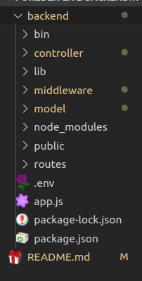
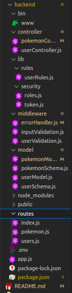
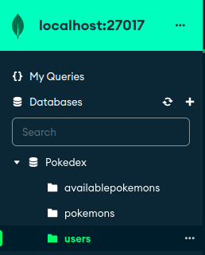
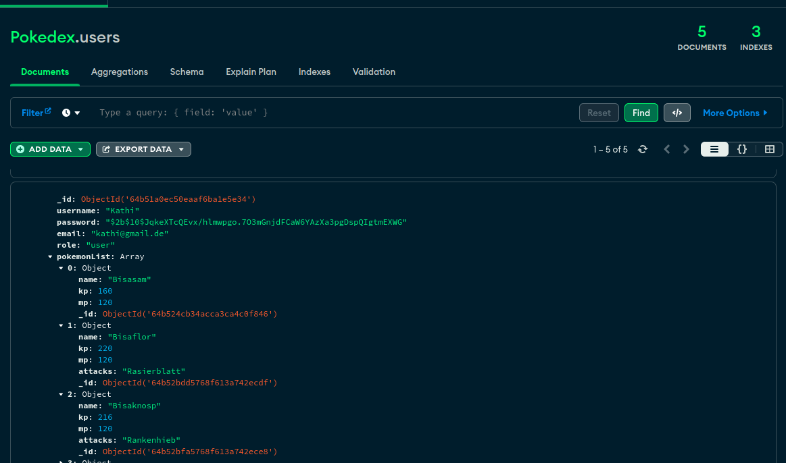

# Pokedex-Lite-Backend-Final-Project

Erstellen von einer Datenbank mit einer Pokemon Collection und einer User Collection.

---

## Inhalt

1. [Zusammenarbeit](#zusammenarbeit)
2. [Informationen](#Informationen)
3. [Scrennshots](#Scrennshots)
4. [Technologies/Frameworks/installations](#Technologies/Frameworks/installations)
5. [Fortsetzung](#Fortsetzung)

## Zusammenarbeit

---

> Im Team für dieses Projekt waren:
>  
> Mohammed Tinmaz & Katharina Groller

## Informationen

---

Als Final-projekt für unsere Abschluss Arbeit haben wir eine backend Database erstellt in MongoDB, mit Javascript.
Wir haben ein signup/login system implementiert und eine collection an Pokemon erstellt welche die User in ihre Liste speichern können.
Zudem gibt es noch diverse admin rechte.

Es wurde für die Verwaltung der User ein sicherheitssystem eingebaut.
Somit können nur Admins alle User einsehen. Für den generel Pfad, dem alle user pfad und dem :id pfad gibt es eine extra authentifizierung um sicher zu stellen das der User auch wirklich der gleiche User ist.

### Scrennshots

 

 

 

-   Die Screenshots dienen zum besseren verständnis

## Technologies/Frameworks/installations

---

Eine liste an technologien, Frameworks and Installationen welche wir im projekt benutzt haben:

**Skriptsprache**

-   Javascript

**Paketmanager**

-   npm

**Laufzeitumgebung**

-   Node.js

**NoSQL Datenbankmanager**

-   MongoDB

**Andere Installationen**

-   bcrypt
-   cookie-parser
-   cors
-   dotenv
-   express
-   express-validator
-   http-errors
-   jsonwebtoken
-   mongoose
-   morgan
-   nodemon

---

## Fortsetzung

---

-   Es wird noch eine entfernen funktion implementiert, womit der Admin Pokemons in der Collection löschen kann.

-   User sollen in zukunft Pokemon in ihrer Pokemon Liste löschen können

-   Angriffe der Pokemon werden in Kategorien unterteilt

-   Das Projekt wird auf Mongo Atlas veröffentlicht

-   Das Projekt bekommt noch ein Frontend

-   Admins sollen auch Pokemons updaten können

-   es sollen noch cookies eingefügt werden
